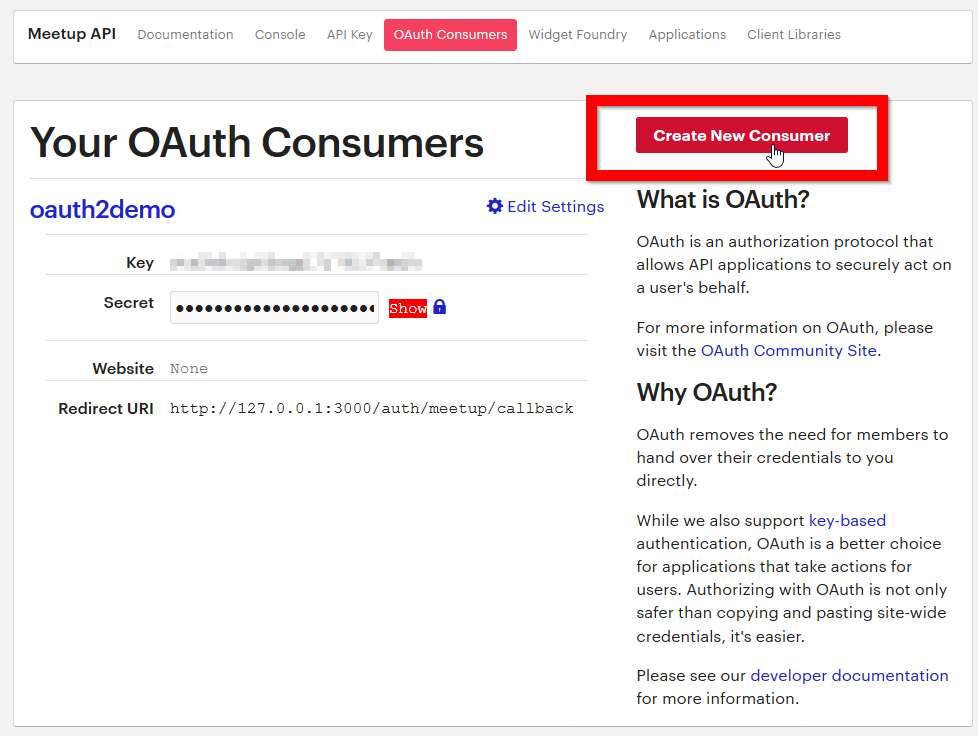

# blog.passportjs_error
ExpressJS site for testing PassportJS error.

## How to run this project.
0. Go to Meetup API [OAuth Consumers Page](https://secure.meetup.com/meetup_api/oauth_consumers/) and generate a consumer key and a secret.
    - 
    - Set the redirect URL to ` http://127.0.0.1:3000/auth/meetup/callback`
0. Rename `.env-copy` to `.env`
0. Fill out both fields in `.env` with your Meetup API consumer key/secret from the first step.
    - MEETUP_API_CONSUMER_KEY=your_meetup_api_consumer_key_here!
    - MEETUP_API_CONSUMER_SECRET=your_meetup_api_consumer_secret_here!
0. Install packages using `yarn` (which is what I used, refer to `yarn.lock` file) or `npm install`
0. Run the site using `yarn debugstart` or `npm run debugstart`